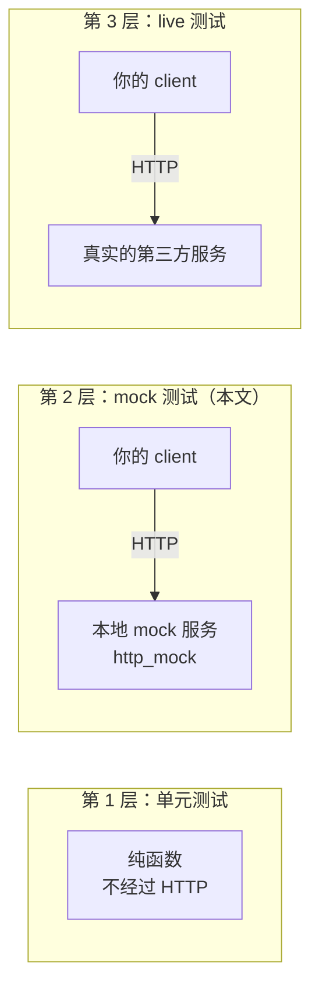
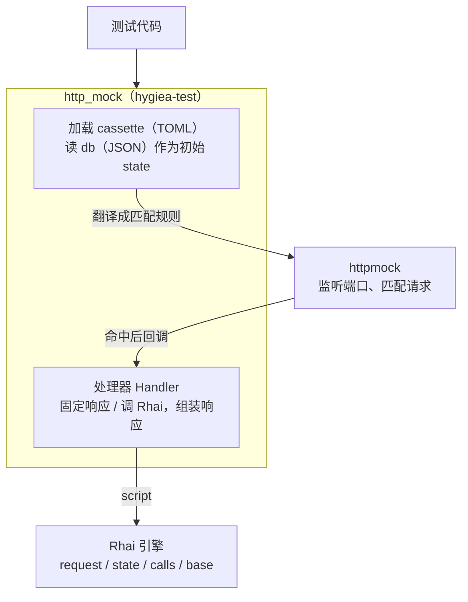
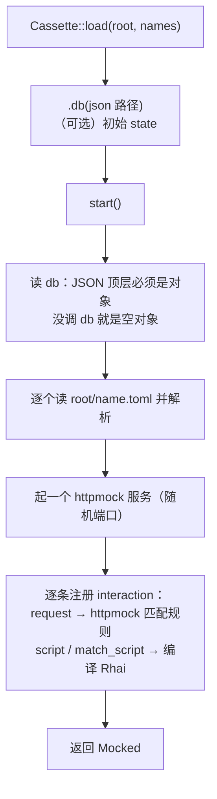
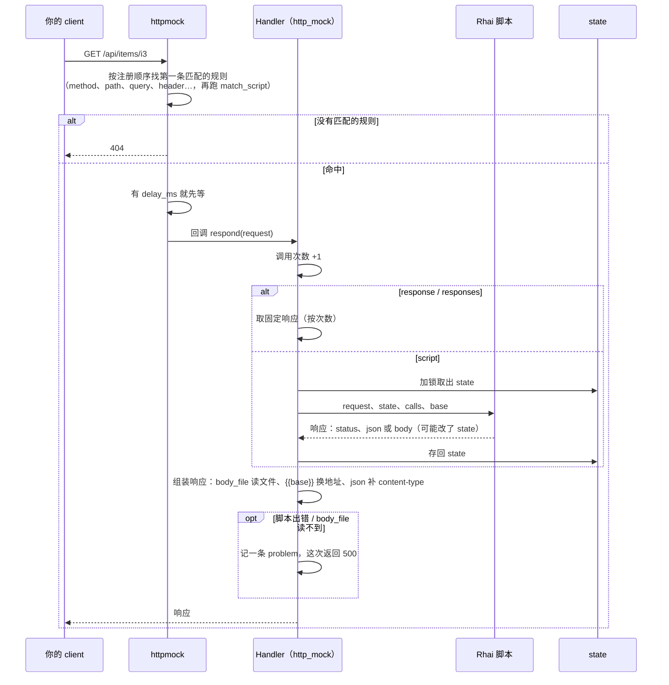

# http_mock：概念和流程

`hygiea-test` 的 `http_mock`（feature `http-mock`）是给使用方写测试用的**本地假 HTTP 服务**。
测试时不连真实的第三方接口，而是在本机起一个服务，把 client 的 base_url 指过去，由它按事先写好的规则返回响应。

图用 Mermaid 画，GitHub、IDEA / RustRover 的 Markdown 预览都能直接显示。

---

## 1. 为什么需要它：测试分三层



| 层 | 连谁 | 解决什么 | 什么时候跑 |
|---|---|---|---|
| 1 | 不连 | 纯逻辑对不对 | 每次 `cargo test` |
| 2 | 本地 mock | client 和业务流程在各种情况下对不对：登录、过期、分页、各种错误码……这些真实服务很难按需制造 | 每次 `cargo test`，不联网、很快 |
| 3 | 真实服务 | 你的 DTO 和对方接口是不是一致；对方改了接口这里先失败 | 手动（`--ignored`），要账号 |

mock 的响应和数据都是你自己写的，http_mock 不替你校验它们对不对；和真实服务是否一致由第 3 层保证。

---

## 2. 核心概念

| 概念 | 是什么 | 对应 |
|---|---|---|
| **cassette** | 一个 TOML 文件，描述一个或几个接口"收到什么请求 → 返回什么"。名字来自录像带的比喻 | `xxx.toml` |
| **interaction** | cassette 里的一条规则：一个 `request`（匹配条件）+ 一种响应方式 | `[[interactions]]` |
| **request 匹配** | 方法、路径、query、header、body……都满足才算这条规则命中；字段名和 httpmock 同名 | `request = { .. }` |
| **响应方式** | 三选一：`response` 固定响应；`responses` 按调用次数依次返回；`script` 用 Rhai 脚本动态计算 | |
| **Rhai 脚本** | 一种嵌在 Rust 里的脚本语言（纯 Rust 实现），用来写"服务端逻辑"：读请求、查数据、改状态、返回响应 | `xxx.rhai` |
| **state** | 一个 mock 服务的全局"内存数据库"，所有脚本共用，改了会保留；测试结束就丢。初始值从一个 JSON 文件读 | `.db("xxx.json")` |
| **Mocked** | `start()` 返回的已启动服务：拿地址、读写 state、检查问题 | `mock.base_url()`、`mock.assert_valid()` |
| **problems** | mock 自身出的问题（脚本报错、`body_file` 读不到……），先记下来，测试最后统一报 | `mock.problems()` |

底层用的是 [httpmock](https://docs.rs/httpmock)：它负责监听端口、解析 HTTP、按规则匹配请求。
http_mock 在它上面加了一层：把 TOML 翻译成 httpmock 的规则，把"怎么响应"交给自己的处理器（固定响应或 Rhai）。



---

## 3. 目录约定

cassette 放在使用方 crate 的 `tests/resources/httpmock/` 下（`cassette_root!()` 就是这个路径）。
http_mock 不规定下面怎么分，推荐按项目分，每个项目下再分 server 和 cases：

```text
tests/resources/httpmock/
└── <项目>/                    比如 moji、momo/markji
    ├── server/                完整模拟服务：一整套接口一起挂
    │   ├── login.toml         一个接口一个 cassette
    │   ├── login.rhai         它的脚本
    │   ├── common.rhai        几个脚本共用的函数（import "common" as c;）
    │   ├── data/              db.json（state 初始值）、脚本读的只读数据（词库之类）
    │   └── bodies/            响应体文件（html / js / mp3）
    └── cases/                 单接口用例：边界情况、错误响应
        ├── login.toml
        ├── login_lock.rhai
        └── data/              用例自己的 db（需要时）
```

cassette 里写的路径（`script`、`match_script`、`body_file`，脚本里的 `read_json`）都**相对 cassette 所在的目录**；
脚本里的 `import` 相对脚本文件自己所在的目录。所以 `cases/` 可以直接复用 `../server/xxx.rhai`。

---

## 4. 启动流程：`start()` 做了什么



- state 的初始值**只有一个来源**：`.db("xxx.json")`（路径相对 cassette 根目录），字段名就是脚本里的 `state.xxx`。
  cassette 里不写 state。server 和 cases 可以用同一个 JSON，也可以各用各的。
- 测试中途要改（比如清空会话模拟过期）用 `mock.update_state(..)`；读出来断言用 `mock.state::<T>()`。

---

## 5. 一次请求的处理流程



测试最后调 `mock.assert_valid()`：有 problem 就 panic，并列出每一条（哪个 cassette、哪条规则、第几次调用、什么错）。

> 为什么不在 mock 服务里直接 panic？服务跑在别的线程，panic 只会让 client 看到连接断开，看不出原因。

---

## 6. cassette 格式

```toml
[[interactions]]
name = "登录"                                  # 报错时用来定位
request = { method = "POST", path = "/api/login", json_body_includes = { kind = "password" } }
script = "login.rhai"                          # 响应方式三选一
# response  = { status = 200, json = { token = "t1" } }
# responses = [{ json = { token = "t1" } }, { json = { token = "t2" } }]
delay_ms = 100                                 # 可选：先等 100ms 再响应（测超时）
match_script = "is_beta.rhai"                  # 可选：Rhai 返回 true 才算匹配
```

### 请求匹配（`request`）

字段名和 httpmock 的方法一样，常用的：

| 字段 | 例子 |
|---|---|
| `method`（必填） | `"GET"` |
| `path` | `"/api/items/{id}"`，`{id}` 是占位符，匹配一段不含 `/` 的路径 |
| `path_prefix` / `path_matches` | `"/tts/"` / 正则 |
| `query_param` | `{ q = "猫" }` 或 `[{ name = "tag", value = "a" }, { name = "tag", value = "b" }]` |
| `query_param_exists` / `_missing` | `"q"` 或 `["q", "limit"]` |
| `header` / `header_exists` / `header_missing` | `{ authorization = "Bearer t" }` |
| `cookie` / `cookie_exists` | `{ sid = "s1" }` |
| `json_body` / `json_body_includes` / `json_body_excludes` | 完全相等 / 包含这些字段 |
| `body` / `body_includes` / `body_matches` | 原始 body |
| `form_urlencoded_tuple` | 表单字段 |

`path`、`path_prefix`、`path_matches` 至少写一个。

### 响应

| 字段 | 说明 |
|---|---|
| `status` | 默认 200 |
| `headers` | `{ content-type = "text/html" }` |
| `body` / `body_file` / `json` | 三选一。`json` 会自动补 `content-type: application/json` |

`body` 和文本的 `body_file` 里写 `{{base}}`，会换成 mock 服务的地址（比如响应里要带一个下载链接，让 client 接着请求 mock）。

---

## 7. Rhai 脚本

脚本的**最后一个表达式就是响应**，字段和上面的"响应"一样；也可以中途 `return`。

```rhai
import "common" as c;                         // 同目录 common.rhai 里的函数

if request.header("x-token") != state.token {
    return #{ status: 401, json: #{ code: "unauthorized" } };
}
let id = request.param("id");                  // path 里的 {id}
state.views += 1;                              // 改 state，下次请求还在
#{ json: #{ id: id, views: state.views } }
```

| 变量 / 函数 | 说明 |
|---|---|
| `request.method` / `request.path` | |
| `request.param("id")` / `request.params` | path 占位符的值 |
| `request.query("q")` / `request.query_all("tag")` / `request.queries` | query 参数，没有是 `()` |
| `request.header("X-Token")` / `request.headers` | 名字不分大小写 |
| `request.cookie("sid")` | |
| `request.json()` / `request.form()` / `request.text()` | 按 JSON / 表单 / 文本（按 charset 解码）读 body |
| `request.content_type` / `request.body_len` | |
| `state` | 这个 mock 服务的全局 state，改了会保留 |
| `calls` | 这条规则第几次被调用，从 1 开始 |
| `base` | mock 服务的地址 |
| `read_json(path)` / `read_text(path)` | 读数据文件，路径相对 cassette 目录 |

---

## 8. 容易踩的坑

- **规则的顺序就是优先级**：httpmock 按注册顺序找第一条匹配的。`/decks/{deck}` 也能匹配 `/decks/folders`，
  所以 `Cassette::load(root, &[..])` 里 list_folders 要排在 get_deck 前面；同一个 cassette 里更具体的规则写在前面。
- **`delay_ms` 只能写在规则上**，脚本里不能动态决定延迟（httpmock 的回调是同步的，在里面 sleep 会卡住服务）。
- **JSON 里的 `null` 在脚本里是 `()`**：判断"有没有值"用 `x != ()`。
- **没有录制功能、不支持 httpmock 原生 YAML**：录下来的只是某一次请求的快照，参数、状态一变就对不上，动态逻辑用 Rhai 写。

---

## 9. 最小例子

`tests/resources/httpmock/shop/cases/hello.toml`：

```toml
[[interactions]]
name = "hello"
request = { method = "GET", path = "/hello/{name}" }
script = "hello.rhai"
```

`tests/resources/httpmock/shop/cases/hello.rhai`：

```rhai
#{ json: #{ greeting: `hello, ${request.param("name")}`, calls: calls } }
```

测试：

```rust
#[tokio::test]
async fn hello() {
    let mock = Cassette::load(cassette_root!(), &["shop/cases/hello"])
        .start()
        .await
        .unwrap();
    let body: serde_json::Value = reqwest::get(mock.url("/hello/cat")).await.unwrap().json().await.unwrap();
    assert_eq!(body["greeting"], "hello, cat");
    mock.assert_valid();
}
```

更完整的例子见 `hygiea-test/tests/http_mock.rs` 和 `hygiea-test/tests/resources/httpmock/common/`。
